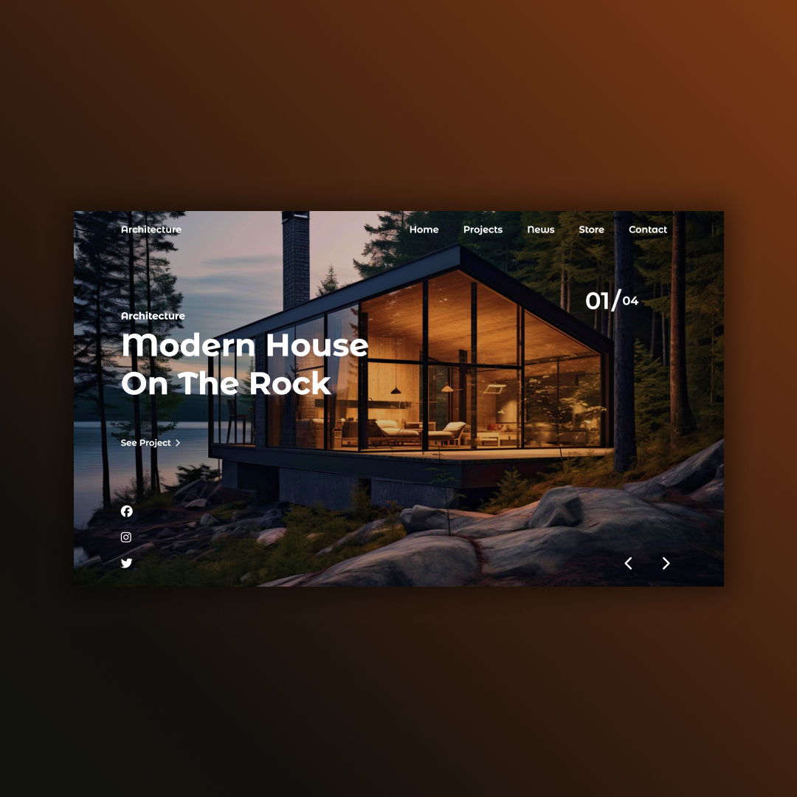
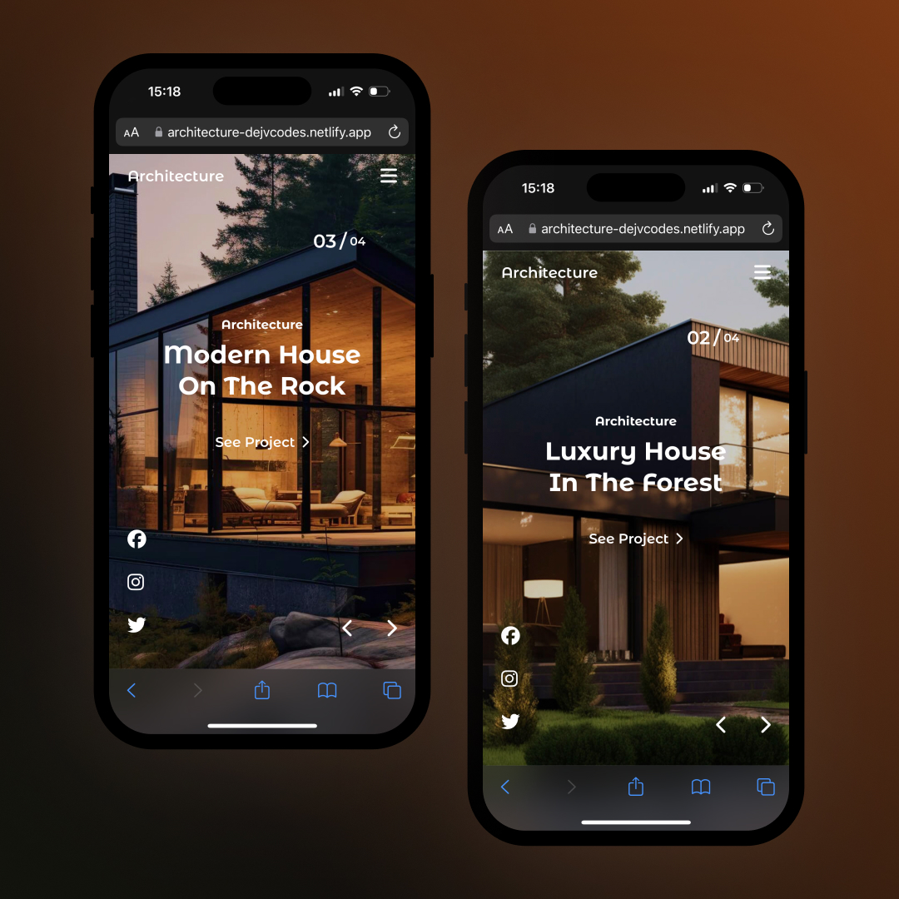

## Architecture Website 
• HTML, CSS, SCSS & JavaScript  
• Contains sliding images with the Swiper JS library.  
• Parallax animations in titles and images.  
• Practicing SCSS  
• Responsive Design 

## Screenshots 📱
 

## 💻 Tech Stack

## 🌐 Link
<a href="https://architecture-dejvcodes.netlify.app/">Architecture</a>

## License🔐
[MIT License](LICENSE) 